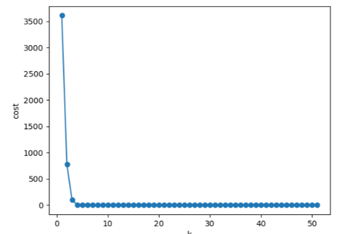

# Assignment 1: Random Search
The first homework assignment has the following three programming tasks.

To complete this assignment, you will need to have installed Python and several other libraries.

# Task 1: Implement the random search algorithm

In the provided starter code, you will find a function called: `random_search(...)`.

The function provides a skeleton for your production of the random local search algorithm. All parts marked "TODO" are for you to construct.

# Task 2: Optimize a function with random search.

Use your completed `random_search` function from the previous task to minimize the function `g(v, w) = 100 (w - v * v) ^ 2 + (v - 1) ^ 2`. This function has a global minimum at the point `w* = (1, 1)` located in a very narrow and curved valley.

Run random search using `P = 1000`, max iteration 50 steps, `a = 1`, and initial parameters `v = -2`, `w = -2` and plot the cost history.

The figure should be similar to this:

# Task 3: Optimize the same function with random search using diminishing step length.

Re-run task 2 but with `a = 1/k`, where k is the iteration count. This requires you to modify the `random_search` function to support diminishing step length.

Compare the cost function history plots with random search with fixed steplength by plotting the cost function history plots for both runs in the same Figure.

Also report the final cost from both methods (with fixed learning rate and with diminishing learning rate).

# Deliverable

- The completed source code hw1.py

- A PDF report

The source code should be able to run by executing the command `python hw1.py`

The PDF report should include:

- Result (both `weight_history` and `cost_history`) of running task 1

- Cost history plot for running task 2

- Cost history plots that compares random search with fixed steplength and random search with diminishing steplength. (Note: you should provide TWO cost history plots in order to get full credit for task 3. One is generated by using all data, and the other is generated by using the data starting from the 10th data. ie You should use `compare_cost_history(costs_fixed[10:], costs_diminished[10:])` to generate a plot from the 10th data point. And then use `compare_cost_history(costs_fixed, costs_diminished)` to generate the other)

- Final cost using a fixed steplength (Task 3)

- Final cost using a diminishing steplength (Task 3)
