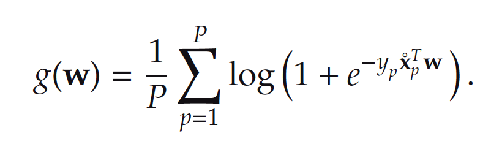
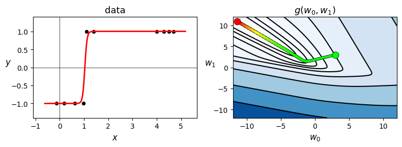
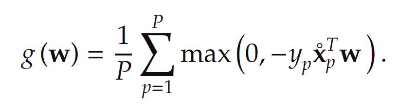

# Homework 4: Logistic Regression

# Task 1: Implementing Linear Classification with Softmax Cost

Code up the linear classification with the Softmax cost function below

Your linear classification will use the 2d classification data in `2d_classification_data_v1.csv` (download [here](https://drive.google.com/file/d/17_i2PHWRnMIQduJVpz22i0RaOTq6t0y7/view?usp=sharing)).

Verify that your implementation is working properly by reproducing the final fit shown in the left picture below. To be more specific, the black dots correspond to data points. The red curve corresponds to the fit with the tanh approximation.

You can initialize the weight at `w = [3, 3]`, use `max_iters=2000`, and `alpha=1.0`. No need to normalize the gradient. Your final result should produce zero misclassifications.

# Task 2: Compare the Efficacy of Two-Class Cost Functions

Compare the efficacy of the Softmax and the Perceptron cost functions in terms of the minimal number of misclassifications each can achieve by proper minimization via gradient descent on a breast cancer dataset (download [here](https://drive.google.com/file/d/1FbEKMaOh_pNYBz-IdNlTGsWOLSc7Q_ao/view?usp=sharing)). The dataset has already been pre-processed so that you can directly learn a linear classification model on it.

This dataset consists of `P = 699` data points, each point consisting of `N = 9` input of attributes of a single individual and output label indicating whether or not the individual does not have breast cancer. You should be able to achieve aroudn 20-40 misclassifications with each method.

Softmax Cost:

Perceptron Cost:

If you need some backgroudn on the breast cancer dataset, you can find the description [here](https://archive.ics.uci.edu/ml/datasets/breast+cancer+wisconsin+(original)). But please don't use the dataset from the official website as the raw dataset is not preprocessed. The input data points are stacked column-wise in this dataset, with the final row being the label of each point.

# Deliverables

Your submission should contain

- The completed source code hw4.py
- A PDF report

The source code should be able to run by executing the command `python hw4.py`.

The PDF report should include:

- Task 1:
  - Report both the accuracy and the misclassification of your model.
  - A figure that shows cost history over iterations. In the figure, the X-axis is the number of iterations, and the Y-axis is the cost.
  - A figure that shows the original data and the fitted tanh curve. This figure should look like the one in this requirement. In this figure, you should clearly indicate which is the original data and which is the fitted tanh curve.

- Task 2:
  - Describe the initial values you choose for weight, alpha, and max iterations, and provide the rationale behind your selection.
  - Report both the accuracies and the misclassifications obtained from the two cost functions seperately.
  - A figure that compares the cost over iterations between two cost functions. In the figure, you should clearly indicate which line represents each cost function.
  - A figure that compares the accuracy over iterations between two cost functions. In the figure, you should clearly indicate which line represents each cost function.