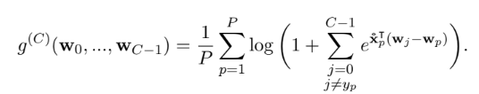

# Homework 5: Multi-Class Classification

# Task 1: Show the multi-class softmax reduces to two-class softmax cost when C = 2

Show that the multi-class softmax cost reduces to the two-class Softmax cost when C = 2 and y_p ∈ {-1, 1}.

The multi-class Softmax cost function (Eq. 7.23 from the book) is given below:

The two-class Softmax cost (eq 6.25 from the book):

Typeset your proof so that it is legible. Make sure to explain your work and clarify steps in your solution where needed, like noting the use of identities or substitutions.

# Task 2: Show the multi-class Softmax is equivalent to two-class cross entropy cost when C = 2

Demonstrate that when C = 2 and yp ∈ {0, 1}, the multi-clss softmax is equivalent to the two-class cross entropy cost.

The multi-class Softmax cost (eq 7.23 from the book):

The two-class cross entropy cost (eq 6.12 from the book):

Typeset your solution and explain the steps in your proof.

# Task 3: Implement the multi-class Softmax for a 4-class classification task

Fill in the provided code template to implement a multi-class classifier using multi-class Softmax cost. Your model will use the synthetic dataset 4class_data.csv (available for download [here](https://drive.google.com/file/d/1e0JaM_2_5lgN9G_oSXXgdnQT48W3jRRq/view?usp=sharing)).

Use any local optimization method you prefer to perform the 4-class classification task. You may reuse your gradient descent solutions and other code from previous homeworks. Feel free to define additional functions such as the model function, the cost function, and python functions that help you plot if they make your code cleaner.

Your trained model should achieve a small number of misclassifications (ten or fewer). You can use theh Python implementation outlined in the slides as a basis for your implementation of the multiclass softmax cost. You should not need to normalize or otherwise transform the data to achieve acceptable classification performance.

Without changing any code of hw5.py, you should see an output like this:

`(2, 40)`

`(1, 40)`

The data looks like the following figure:

You may use the provided plotting function show_dataset_labels to generate a figure showing the label regions of your classifier solution. Without modifying the classifier argument, you should see the following figure:

Report the final cost and the accuracy of your solution, include in your report a plot showing the original data and labeling regions of your classifier solution. Your results should be reproducible.

Deliverables

Your submission should contain

- The completed source code hw5.py
- A PDF report

The source code should be able to run by executing the command `python hw5.py`. The PDF report should include:

- Task 1:
  - A typeset proof showing that the multi-class softmax cost reduces to the two-class Softmax cost when C = 2 and yp ∈ {-1, 1}

- Task 2:
  - A typeset proof showing that the multi-class Softmax cost is equivalent to two-class Cross Entropy cost when C = 2 and yp ∈ {0, 1}

- Task 3:
  - A description of your multi-class classification model solution including local optimization method, the initial values you choose for weights, values of parameters (alpha, max iterations, lambda), and any additional techniques applied. Provide the rationale behind your selection.
  - The final cost and accuracy of your solution to the 4-class classification task.
  - A figure showing the original data and regions of your model solution.