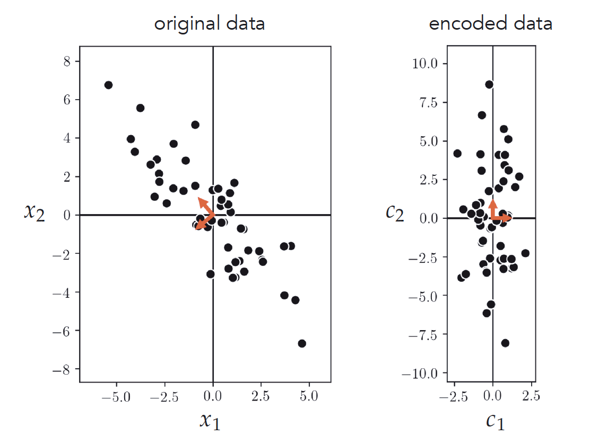
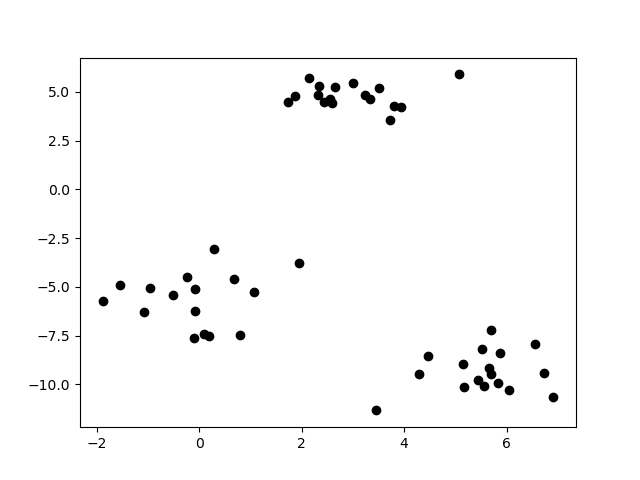
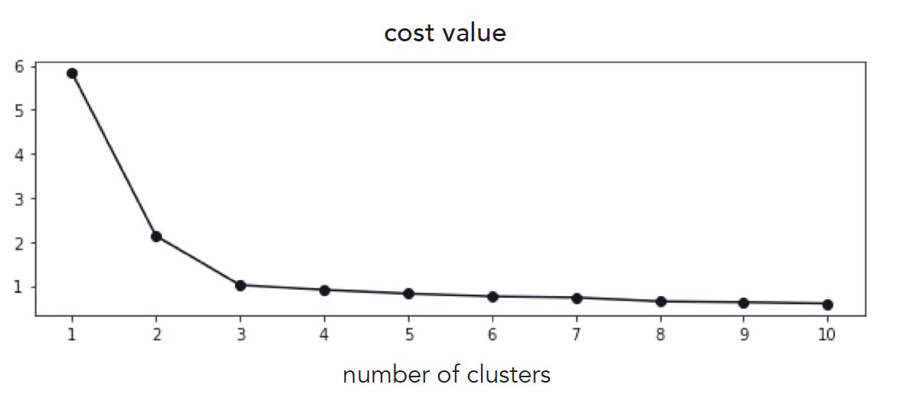

# Homework 6: Unsupervised Learning

# Task 1: Implementing PCA

Implement the PCA algorithm using the given 2-d data (download the data [here](https://drive.google.com/file/d/1B6ODq1DlYwMJILax_Hu2FbbY4g2pHfGs/view?usp=sharing)). Reproduce the illustrations shown in the figure below. You may use the implementation given in the slides as a basis for your work. 

In the 1st figure, show the mean-centered data along with its two principal components (pointing in the two orthogonal directions of greatest variance in the dataset).

In the 2nd figure, show the encoded version of the data in a space where the principal components are in line with the coordinate axes.

# Task 2: Implementing K-means

Implement the K-means algorithm and apply it to properly cluster the given dataset using K=3 cluster centroids.

1. Visualize your results by plotting the clustered dataset, coloring each cluster using a unique color. You might want to try to run the k-mean algorithm multiple times for each value of K to mitigate the bad initialization problem.
  The original data looks like this: 

2. Make a scree plot by varying the number of clusters from 1 to 10. You might want to try to run the k-mean algorithm multiple times for each value of K to mitigate the bad initialization problem. Your scree plot should look like this: 

# Deliverables

Your submission should contain:
- The completed source code hw6.py
- A PDF report

The source code should be able to run by executing the command `python hw6.py`

The PDF report should include:
- Task 1:
  - Briefly describe how you implement PCA. You may include equations in your report to help with your explanation.
  - A figure that shows the mean-centered data along with its two principal components. In the figure, include the data points and arrows indicating the two principal components.
  - A figure that shows the encoded version of the data in a space where the principal components are in line with the coordinate axes. In the figure, include the data points and arrows indicating the two principal components.
- Task 2:
  - Describe how you initialized the centroids and why you choose this method.
  - A figure that visualizes your clustering results when K=3. To be more specific, you should color each cluster and put labels to indicate the clusters in the figure (not in the report). You should also highlight the centroid of each cluster and put labels to indicate the centroids as well.
  - Scree plot by varying the number of clusters from 1 to 10. Based on the plot, answer what is the best K for this problem and why.