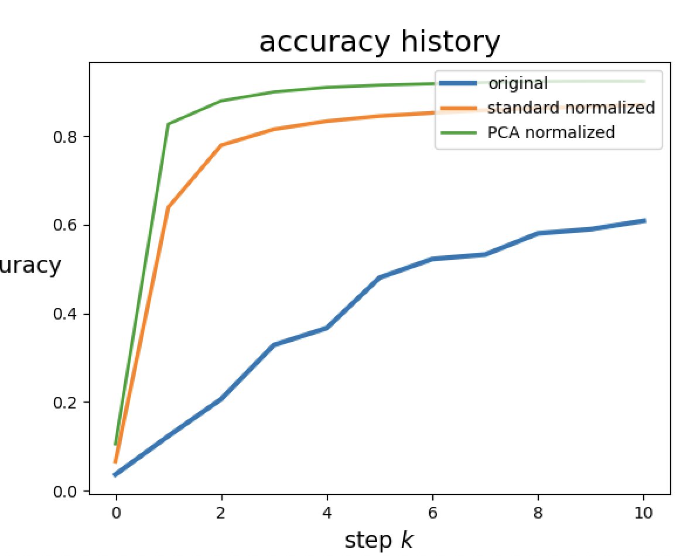
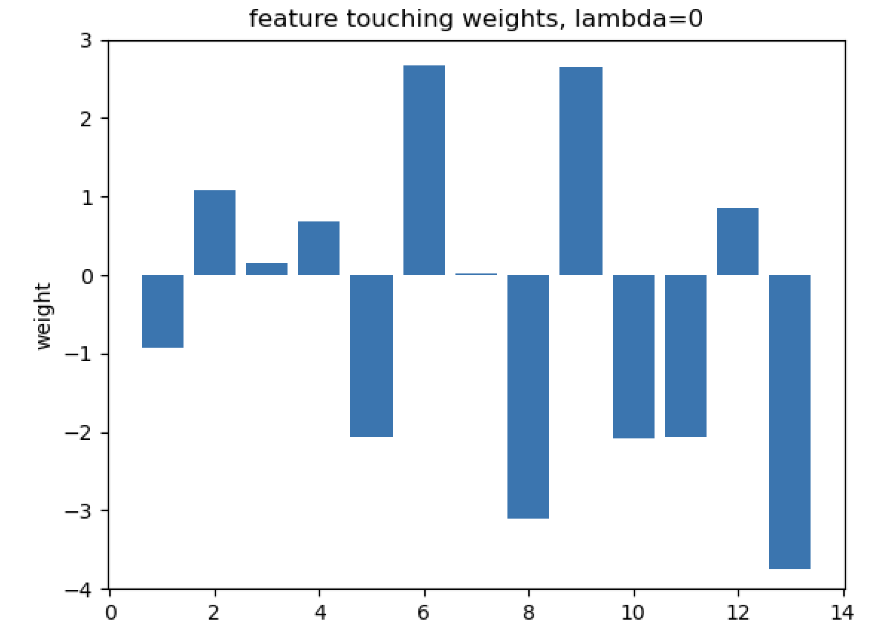
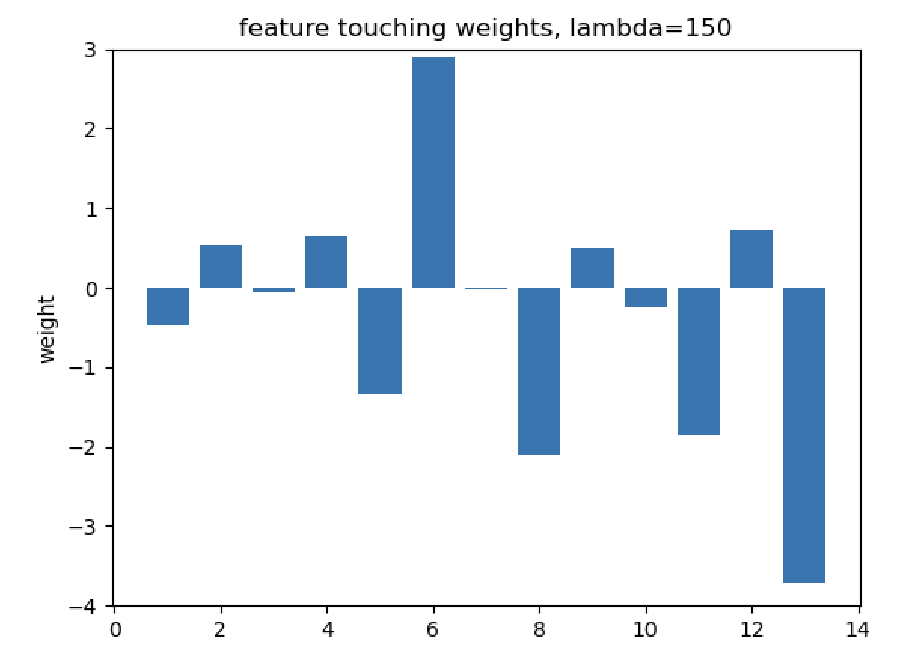

# Homework 7: Feature Engineering

Complete the tasks by filling in the TODOs of the provided code template hw7.py. Feel free to define additional functions if they make your code cleaner.

You could also reuse your code from previous homeworks and from the [textbook notes](https://github.com/jermwatt/machine_learning_refined). Particularly, the [textbook notes of chapter 9](https://github.com/jermwatt/machine_learning_refined/tree/main/notes/9_Feature_engineer_select/chapter_9_library) have both the [PCA-sphering](https://github.com/jermwatt/machine_learning_refined/blob/main/notes/9_Feature_engineer_select/chapter_9_library/section_9_7_helpers.py#L149) and [standard normalization](https://github.com/jermwatt/machine_learning_refined/blob/main/notes/9_Feature_engineer_select/chapter_9_library/section_9_7_helpers.py#L125) source code. Use with caution.

You should use numpy functions instead of jax.numpy for the PCA and standard normalization. Here, normalization is a parameter-free data pre-processing step and should not be involved in the auto differentiation in Jax.grad.

# Task 1: Comparing standard normalization to PCA-sphering on MNIST

Compare a run of ten gradient descent steps using the multi-class Softmax cost over 50,000 random digits from
1. the base MNIST dataset
2. a standard normalized version
3. a PCA-sphered version
of the data. Note that the entire MNIST dataset consists of 70K data samples. You can use the first 50K data samples for model training.

For each run, find the largest fixed steplength of the form alpha = 10^y for y an integer you find to produce descent. You can compare the final cost. The integer that produces the smallest final cost after 10 iterations should be picked.

Create a plot comparing the progress of each run in terms of the cost function and the accuracy. You should return 5 plots: 1 for each cost individually, 1 with all the costs together, 1 with all the accuracies.

Describe what you see.

Additionally, make sure your initialization of each run is rather small, particularly the first run where you apply no normalization at all to the input as each raw input point of the dataset is large in magnitude. In the case of the raw data initializing at a point too far away from the origin can easily cause numerical overflow, producing NaN of INF values, ruining the rest of the corresponding local optimization run.

The starter code already provides you two functions to help with task 1.
- model(x,w)
- multiclass_softmax(w,x,y) - implemented with the logsumexp trick to avoid the overflow problem

Tips:
- Your cost should be dropping for the three cases (without normalization, standard normalization, and PCA normalized data)
- You should be expecting to see accuracy curves comparison like the following figure. Your curves might not look exactly the same due to randomness in initialization. Make sure each curve in your plots has the corresponding legend!
- You should use the `np.random.seed()` function to make sure your code is reproducible for graders.
- You don't need to use L2 regularization in your cost function for this task
- The standard gradient descent with a fixed learning rate should work on the dataset. You don't need to diminish theh learning rate or normalize the gradient. You don't need mini-batch based training.

# Task 2: Exploring predictors of housing prices

Implement the L1 regularization procedure for linear regression employing the Least Squares cost. You can download the dataset [here](https://drive.google.com/file/d/19JiWJMBWN8B9zu-UWru-e4BlgzjjRufy/view?usp=sharing).

You should standard normalize the data first before feeding them into the linear regression model.

Examine λ = 0, 50, 100, 150.

For each value of λ, run gradient descent with a fixed number of steps and step length parameter to minimize the regularized cost. You will need to figure out these parameters to make sure your model can converge.

Plot the visualizations of feature importance as shown below for the four λ values. The figure below illustrates the results for only two values. The main conclusion of the below charts is that "as λ becomes larger, some features remain the important features as their weight values are not close to zero".

 

You should produce histograms of feature touching weights for each value of λ and explain what you see based on your solutions. Note that you need not reproduce the exact same visualizations.

Tips:
- You could use the same learning rate and max_iters for different lambdas
- You should use a standard normalizer. Use of PCA-normalizer will cause the trend to be less obvious
- The above figure is plotted using `plt.bar()` function
- You should set `ylim` to be consistent across different lambdas. It will make it easier to compare the bar graphs across different lambdas. In the above figure, the line of code that set ylim is `plt.ylim([-4,3])`

# Deliverables

Make sure all plots have a clear legend
- Task 1:
  - You should return 5 plots: 1 for each cost individually, 1 with all the costs together, 1 with all the accuracies
    - Plot of the cost functions over the 10 runs
    - Plot of the accuracies over the 10 runs
  - Choice of gamma for:
    - Raw data without normalization
    - Standard normalized data
    - PCA-sphered data
  - An explanation of what you see
- Task 2:
  - Histogram of weights for:
    - λ = 0
    - λ = 50
    - λ = 100
    - λ = 150
  - Step-length, number of steps, and final cost for the figures
  - Plot the cost history for each lambda to demonstrate that your model converged
  - Explanation of what you see (and whether or not you can recreate the plots)